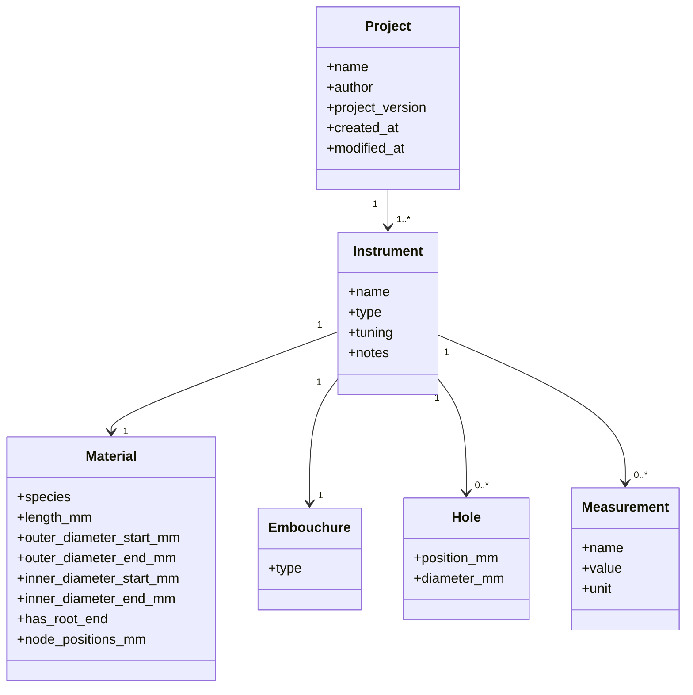

# Domain Model

## Overview

## Design Principles

* Models are independent from the GUI.
* Models are independent from the acoustic engine.
* Models are independent from file storage.
* Models use Python dataclasses.
* Models are fully covered by unit tests.
* Serialization is implemented outside the models.
